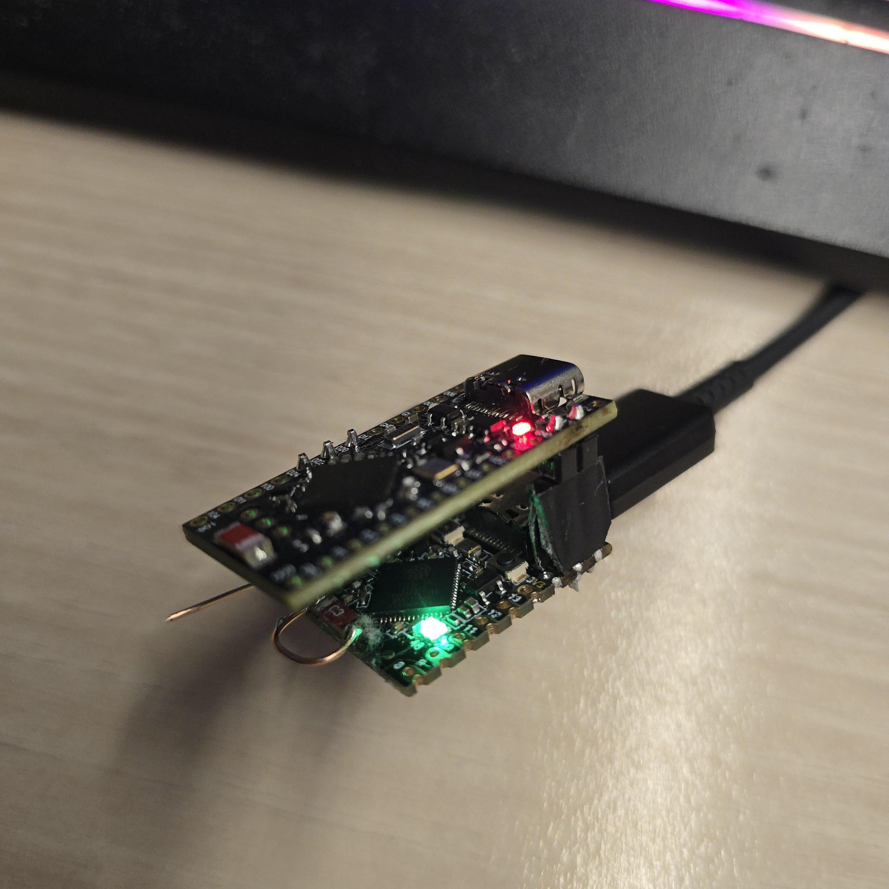

# pinguino-ha-remote


A connected remote that controls a **De'Longhi Pinguino air-conditioner** from your LAN /
Home Assistant by **emulating its manual BLE remote** (the "Ganymede" — a Cypress PSoC 4
BLE HID keyboard). The emulator enters pairing, lets the AC (which is the BLE *central*)
connect and bond, then sends the **same HID button reports** as the original remote.

**Status:** working end-to-end — a web/MQTT command (`press power`, `up`, `down`, `mode`,
…) bonds with the AC and **changes its state on-air**.

## How it works — two radios, by necessity

The ESP32 cannot do this device's BLE: its radio neither sniffs the real remote nor gets
accepted by the AC as an emulator (both verified). So the job is split:

- **nRF52840** — the BLE radio for everything: the emulator that impersonates the remote,
  and (on a second board) the Nordic nRF Sniffer used for reverse engineering.
- **ESP32-S3** — a Wi-Fi bridge only (MQTT/HTTP ↔ UART to the nRF emulator).

```
HA / LAN ──MQTT/HTTP──► ESP32-S3 ──UART──► nRF52840 (emulator) ──BLE──► AC (central)
                                            nRF52840 (nRF Sniffer) ──► Wireshark
```

The AC's gate for accepting the emulator turned out to be the remote's **Cypress address
OUI (`00:A0:50`)** at the link layer — faked on the nRF, which is why the nRF (not the
ESP32) must own the BLE side.

## Hardware

### Bill of materials

| Qty | Part | Role | Notes / source |
|-----|------|------|----------------|
| 1 | **ESP32-S3 SuperMini** (ESP32-S3FH4R2) | Wi-Fi/MQTT/HTTP bridge | UART to the nRF + WS2812 status LED — [AliExpress](https://fr.aliexpress.com/item/1005008807808123.html) |
| 1 | **nRF52840 SuperMini** (nice!nano v2-compatible "Pro Micro" red board) | BLE remote emulator | Adafruit UF2 bootloader; runs the Zephyr app — [AliExpress](https://fr.aliexpress.com/item/1005008099333183.html) |
| 1 | **nRF52840 SuperMini** (same board) | nRF Sniffer (reverse-engineering only) | flashed with Nordic sniffer firmware — same source as above |
| 1 | **BME280 / BMP280** sensor module | ambient temperature / humidity / pressure | I²C to the ESP32; reported to Home Assistant — [AliExpress](https://fr.aliexpress.com/item/1005007527106667.html) |
| — | USB cables | power + flashing | one per board |
| — | jumper wires | ESP32 ↔ nRF UART + BME280 I²C | 3 UART lines + I²C |

> The two nRF52840 boards are identical SuperMini units — one runs the emulator, one is
> flashed as the sniffer for RE work. A deployment that's already reverse-engineered needs
> only **one** nRF (emulator) + the ESP32-S3 (+ optional BME280).

ESP32 ↔ nRF wiring: `GPIO4 → P0.20` (ESP TX → nRF RX), `GPIO5 ← P0.22` (ESP RX ← nRF TX),
`GPIO6 ← P0.24` (heartbeat). Bridge UART is 115200 8N1.
BME280 ↔ ESP32 I²C: `SDA → GPIO2`, `SCL → GPIO1`.

### Assembled hardware

| | |
|---|---|
|  |  |
| nRF52840 emulator (front) + ESP32-S3 bridge (wire antenna) + BME280 (purple module) | Powered stack — red = nRF, green = ESP32-S3 |

## Quick start

1. **Flash the nRF emulator** — see [`firmware/nrf52_emulator/README.md`](firmware/nrf52_emulator/README.md).
   The working firmware is the **Zephyr / nRF Connect SDK** app under
   [`firmware/nrf52_emulator/zephyr/`](firmware/nrf52_emulator/zephyr/) (build with `west`,
   flash the resulting `.uf2`). The Bluefruit/Arduino path is historical — it can't fake
   the Cypress link-layer identity the AC requires.
2. **Flash the ESP32-S3 bridge** — see [`firmware/esp32_bridge/README.md`](firmware/esp32_bridge/README.md)
   (ESP-IDF v6.0.1). Provision Wi-Fi/MQTT from its web UI.
3. **Pair**: put the AC into pairing mode; it bonds with the emulator. The bridge LED goes
   green when ready to relay.
4. **Control**: use the bridge web UI, an MQTT command, or the nRF USB shell (`emu press
   power`).

For reverse engineering / sniffing, see [`tools/nrf_sniffer/README.md`](tools/nrf_sniffer/README.md).

## Protocol & reverse engineering

This is the condensed story of how the Ganymede remote works and how it was reverse
engineered. The **authoritative, evidence-traced** version — every claim tagged with a
`Status` (`observed`/`inferred`/`partial`/`unknown`) and a `Source` capture — lives in
[`docs/ganymede_protocol.md`](docs/ganymede_protocol.md); board/build specifics are in
[`docs/HARDWARE.md`](docs/HARDWARE.md).

### How it was reverse engineered

The remote was characterised from three independent vantage points, then cross-checked:

1. **nRF52840 nRF Sniffer + Wireshark** (`tools/nrf_sniffer/`) — passive, on-air capture
   of the advertising, connection, link-layer control PDUs, SMP, and ATT traffic. This is
   the only observer that sees the real **remote ↔ AC** link (a phone/ESP32 GATT scanner
   cannot). Note: the remote stops advertising under **active** scanning (`SCAN_REQ`), so
   it must be sniffed **passively**.
2. **Android HCI snoop** (`btsnoop_hci.log` from a phone that paired the remote *and* the
   AC) — decoded with `tshark`/Wireshark for the GATT database, SMP exchange, and the
   `Read Remote Version` that exposed the chip identity.
3. **Linux / BlueZ** (`tools/linux-ble/`) — `btmon` for advertising decode plus a D-Bus
   central harness to connect, enumerate services, and exercise pairing.

Discipline: nothing is promoted to `observed` without a capture; the captures themselves
are kept local-only (see [`captures/README.md`](captures/README.md)).

### Identity

| Field | Value |
|------|-------|
| Name / appearance | `Ganymede` · `0x03C1` (HID Keyboard) |
| Silicon | **Cypress CYBLE-212020-01** (PSoC 4 BLE, Cortex-M0, **BLE 4.2**), OUI `00:A0:50` |
| Address | public, `00:A0:50:XX:XX:XX` |
| Role | BLE **peripheral** — the **AC is the central** and initiates the connection |

### Advertising

LE 1M **legacy `ADV_IND`**, sparse low-power bursts (~3 s per pairing-button press):

```text
ADV_IND   : Flags 06 · Name "Ganymede" · UUID16 180A,180F,181A · Appearance 03C1   (no mfg data)
SCAN_RSP  : Manufacturer data FF · Company 0x0131 (Cypress) · payload 3B 04  →  on air: ff 31 01 3b 04
```

The HID service (`0x1812`) is **not** advertised — it's found via GATT after connecting.
The Cypress manufacturer data rides in the **scan response**, so the AC must active-scan to
read it; the emulator therefore puts the Cypress mfg data in its scan response to match.

### GATT database

| Service | UUID | Handles |
|---------|------|---------|
| Generic Access / Attribute | `0x1800` / `0x1801` | 0x0001–0x000B |
| Device Information | `0x180A` | 0x000C–0x001A |
| Battery | `0x180F` | 0x001B–0x001D |
| Environmental Sensing | `0x181A` | 0x001E–0x0036 |
| **Human Interface Device** | **`0x1812`** | **0x0037–0x004B** |

The business end is the **HID Input Report** (`0x2A4D`, value handle **`0x003B`**,
properties Read + **Notify**, CCCD `0x2902`, Report Reference `0x2908 = 00 01`). The
Report Map (`0x2A4B`) is a **standard 61-byte boot keyboard**: one 8-byte input report,
no Report ID. Device Information exposes Manufacturer/Model/Serial/FW/HW strings, System
ID, and a **PnP ID** (Cypress VID `0x0131`). Environmental Sensing carries the remote's
own ambient Temperature/Humidity/Pressure (this is what the BME280 stands in for).

### Buttons → HID reports (confirmed)

Each press emits **one 8-byte notification, sent twice on air, with no key-release**
(fire-per-press). Report layout = `{0, 0, byte2, byte3, 0, 0, 0, 0}`:

| Button | Manual | Report bytes | Bit |
|--------|:------:|--------------|-----|
| Power  | D1 | `00 00 01 00 00 00 00 00` | byte2 b0 |
| Down / decrease | D4 | `00 00 02 00 00 00 00 00` | byte2 b1 |
| Up / increase | D7 | `00 00 04 00 00 00 00 00` | byte2 b2 |
| Mode   | D6 | `00 00 08 00 00 00 00 00` | byte2 b3 |
| Eco (myEcoRealFeel) | D8 | `00 00 10 00 00 00 00 00` | byte2 b4 |
| Timer  | D5 | `00 00 20 00 00 00 00 00` | byte2 b5 |
| Fan / airflow | D3 | `00 00 40 00 00 00 00 00` | byte2 b6 |
| Silent | D2 | `00 00 80 00 00 00 00 00` | byte2 b7 |
| Flap / swing | D9 | `00 00 00 01 00 00 00 00` | byte3 b0 |

The remote is **stateless** — it sends keypresses and nothing flows back, so the AC's
current setpoint/mode/timer are **not** readable (there is no AC→remote channel).

### The pairing gate (the hard part)

The single biggest finding: **the AC validates the peripheral's chip identity before it
will pair.** On-air order from a working pairing is `connect → LL Feature Req → LL Version
Ind → SMP Pairing Request → GATT`. The AC reads the remote's **LL Version Information** and
only proceeds if it looks like a genuine Cypress remote:

| LL field | Real remote |
|----------|-------------|
| LMP/LL version | **BLE 4.2** (`0x08`) |
| Company ID | **`0x0131` = Cypress** |
| LL subversion | `0x1200` (4608) |

An **nRF52840 + Nordic SoftDevice reports Company `0x0059` (Nordic) / BLE 5.x** here. The
AC connects, reads "Nordic / 5.x", and **silently refuses to pair** (no Pairing Request,
discover-only) — reproduced repeatedly. This is why:

- **Bluefruit/Arduino is a dead end** — the LL company ID is baked into the SoftDevice and
  not settable. The working firmware is **Zephyr / nRF Connect SDK**, where the controller
  identity is configurable and a **public address with the Cypress OUI `00:A0:50`** can be
  set. Faking the OUI turned out to be the gate that let the AC bond.
- **The ESP32 can't do the BLE at all** — its radio never locks onto the remote's brief
  low-power Cypress `ADV_IND` (verified; a phone, a different radio, does), and the AC
  never connects to an ESP32 emulator. So BLE lives entirely on the nRF52840 and the ESP32
  is Wi-Fi-only.

### Pairing & security (SMP)

Once the identity gate passes, pairing is **Just Works, LEGACY** — responder IO
capability `NoInputNoOutput`, AuthReq Bonding with **SC=0, MITM=0**, 16-byte key,
distributing LTK + IRK + CSRK. No passkey. The SMP method was never the blocker; the
LL-identity check above was.

### Connection behaviour & pairing procedure

Connection establishment is a **lottery** — many attempts drop with HCI `0x3E`; a working
link uses a fast 30–50 ms interval, ~5 s supervision timeout, latency 0, no concurrent
scan, with the remote held in pairing mode. Only one central can hold the link at a time
(a bonded phone or the AC will steal it).

Re-pairing is a two-sided, 60-second dance (from the De'Longhi/Pinguino manual): hold
**MODE** on the remote ~10 s until its LED blinks (it un-pairs and starts advertising —
for the emulator, *advertising = pairing mode*), then hold **MODE** on the AC ~10 s until
it acknowledges; the AC's display dot blinks rapidly during the pairing window.

## Repository layout

| Path | Contents |
|------|----------|
| `firmware/esp32_bridge/` | ESP32-S3 Wi-Fi/MQTT/HTTP ↔ UART bridge (ESP-IDF) |
| `firmware/nrf52_emulator/` | nRF52840 BLE remote emulator (`zephyr/` = working; `reference/` = NimBLE source-of-truth) |
| `tools/nrf_sniffer/` | Nordic nRF Sniffer firmware + Wireshark extcap + capture helper |
| `tools/linux-ble/` | Linux/BlueZ central harness to test the emulator before the AC |
| `docs/` | `ganymede_protocol.md` (protocol & RE findings) + `HARDWARE.md` (board/build notes) |
| `docs/references/` | Device datasheets + De'Longhi AC manual (PDF) |
| `captures/` | **Local-only** RE captures (excluded from git — see `captures/README.md`) |
| `CLAUDE.md` | Internal guidance for the Claude Code agent (not user docs) |

Every protocol claim in `docs/` carries a **Status** (`observed`/`inferred`/`partial`/
`unknown`) and a **Source** capture, so the reverse engineering is auditable.

## License

[MIT](LICENSE) for this project's own code and docs. Third-party components keep their
upstream licenses: the Nordic **nRF Sniffer** firmware/extcap under `tools/nrf_sniffer/`,
ESP-IDF managed components, and the NimBLE reference under
`firmware/nrf52_emulator/reference/`.
